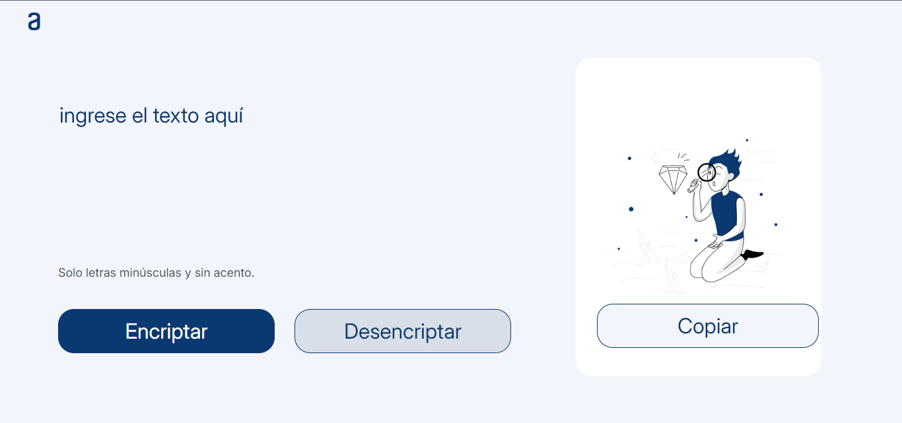

# Encriptador de Texto

Este proyecto es una solución para un challenge propuesto por Alura, enfocado en la creación de una aplicación web que permite encriptar y desencriptar mensajes. El objetivo principal es construir una interfaz intuitiva y funcional que permita a los usuarios ingresar texto, encriptarlo según un patrón específico, y desencriptarlo de vuelta al formato original.

## Características

- **Interfaz de Usuario**: Campo de texto para ingresar mensajes y botones para encriptar, desencriptar y copiar el texto resultante.
- **Validaciones**: Solo se permite la entrada de letras minúsculas sin acentos. Cualquier número o símbolo ingresado será removido automáticamente.
- **Encriptación/Desencriptación**: Sustitución de vocales por cadenas específicas para encriptar el mensaje, y viceversa.

## Captura de Pantalla

## Tecnologías Utilizadas

- **HTML**
- **CSS**
- **JavaScript**

## Cómo Usar

1. Clona este repositorio.
2. Abre el archivo `index.html` en tu navegador web.
3. Ingresa un texto en el área designada y selecciona la opción de encriptar o desencriptar.

## Contribuciones

Las contribuciones son bienvenidas. Por favor, abre un *pull request* o un *issue* para discutir cualquier cambio o mejora que quieras proponer.

